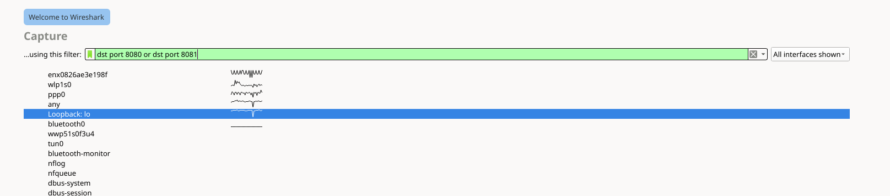

# Network

- Forward an TCP request to a local interface to a remote one: `socat TCP4-LISTEN:4321,fork TCP4:<remote-addr>:4321`

## Wireshark

- CaptureFilters: select interface, then input the filter conditions like this: `dst port 8080 or dst port 8081`

  

- DisplayFilters, typically your condition is like this: `tcp.dstport == 8080`

## Modem

Enable modem on Linux: `sudo mbimcli --device-open-proxy --device="/dev/cdc-wdm0" --quectel-set-radio-state=on`

## Apache SSL-enabled reversed proxy

- Enable necessarily modules: `a2enmod proxy_http`, `a2enmod ssl`

- Create a conf file: `/etc/apache2/sites-enabled/reverse-proxy-ssl.conf`:

```
<VirtualHost *:443>

    ServerName server.lan

    ProxyPreserveHost On

    ProxyPass           /                http://127.0.0.1:444/
    ProxyPassReverse    /                http://127.0.0.1:444/

    ErrorLog ${APACHE_LOG_DIR}/error.log
    CustomLog ${APACHE_LOG_DIR}/access.log combined
    SSLEngine on

    SSLCertificateFile      /etc/letsencrypt/<fullchain/cert>.pem
    SSLCertificateKeyFile   /etc/letsencrypt/privkey.pem

</VirtualHost>
```

- Enable the site: `a2ensite reverse-proxy-ssl`

## Bridge

- For our purpose, a network bridge is nothing but a virtual switch.

- Prerequisite: `apt install bridge-utils`

- Create a bridge:

  1.  Create a bridge device: `brctl addbr br0`
  1.  Check existing network structure with `ip a` and find the physical device
      which has Internet access. In the following case, the physical NIC is `eno0`:

          ```
          1: eno0: <BROADCAST,MULTICAST,UP,LOWER_UP> mtu 1500 qdisc pfifo_fast state UP group default qlen 1000
            link/ether 00:11:22:33:44:55 brd ff:ff:ff:ff:ff:ff
            inet 172.16.0.123/24 brd 172.16.0.255 scope global dynamic noprefixroute eno0
              valid_lft 7066sec preferred_lft 7066sec
          ```

  1.  Add an existing device to the bridge. We need to change
      `/etc/network/interfaces` from something like:

          ```
          auto eno0
          iface eno0 inet dhcp
          ```

          to:

          ```
          #auto eno0
          #iface eno0 inet dhcp

          auto br0
          iface br0 inet dhcp
          # bridge_ports roughly means which hardware interfaces should be plugged
          # in to the virtual bridge.
              bridge_ports eno0
              bridge_stp off # If we only have a single bridge, should turn it off
          ```
          * There are a few more options you can set, can find more details
          [here](https://wiki.ubuntu.com/KvmWithBridge)

  1.  Make the new bridge effective: `systemctl restart networking.service`

- List all ethernet bridges: `brctl show`.

## Enable Wi-Fi sharing in AP mode

- USB Wi-Fi adapters that support AP mode on Raspberry Pi OS are pretty rare.
  Can find a list of them [here](https://elinux.org/RPi_USB_Wi-Fi_Adapters)

- Finishing all steps using headless SSH is possible but risky,
  preparing physical keyboard and monitor would make the process much safer.

- A valid network bridge is needed, refer to the section above on how to
  configure that.

- Install `hostapd`: `apt-get -y install hostapd`.

- Disable them for the time being: `systemctl stop hostapd`.

- For Raspberry Pi, enabling predictable network interface naming with
  `raspi-config` if needed (important note: if network bridge has been defined
  using simple network interface names, revising naming convention may break
  SSH on reboot.).

- Append `denyinterfaces wlan0` and `denyinterfaces eth0` to `/etc/dhcpcd.conf`
  to disable dynamic IP allocation to the subject ethernet and WLAN interfaces.

  - Note: generic Debian system uses another DHCP client, `dhclient`, which doesn't support the above directive.
  - Alternatively, adding `iface eth0 inet manual` to `/etc/network/interfaces` will also do.

- Append the WiFi interface to the `bridge_ports` section of the configured
  network bridge in `/etc/network/interfaces`. Here we use `wlan0` as an
  example:

  ```
  # Bridge setup
  auto br0
  iface br0 inet dhcp
    bridge_ports eno0 wlan0
  ```

- Add the lines to `/etc/hostapd/hostapd.conf`

```
interface=wlan0
bridge=br0
#driver=nl80211
ssid=Hotspot-Name
hw_mode=g
channel=11
wmm_enabled=1
# Wi-Fi Multimedia (WMM) is a Wi-Fi Alliance interoperability certification.
# It provides basic Quality of service (QoS) features to IEEE 802.11 networks.
# In the field of computer networking, quality of service refers to traffic
# prioritization and resource reservation control mechanisms rather than the
# achieved service quality.
macaddr_acl=0
auth_algs=1
ignore_broadcast_ssid=0
wpa=2
wpa_passphrase=your_very_complicated_password
wpa_key_mgmt=WPA-PSK
wpa_pairwise=TKIP
rsn_pairwise=CCMP
```

- Unmask `hostapd`if needed: `systemctl unmask hostapd`.

- Restart and the AP should work

- Just to be sure, after reboot, can issue `brctl show` to check if the network bridge is established as expected.

### Troubleshooting

- The log of `hostapd` usually goes to `/var/log/syslog`, you may find some
  useful information here.

- It appears to be the case that we need to disable `wpa_supplicant` to make
  `hostapd` work: `systemctl mask wpa_supplicant`
